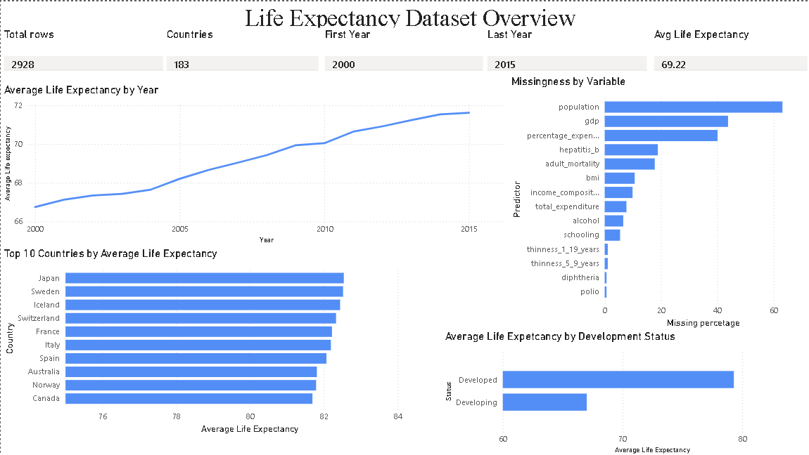
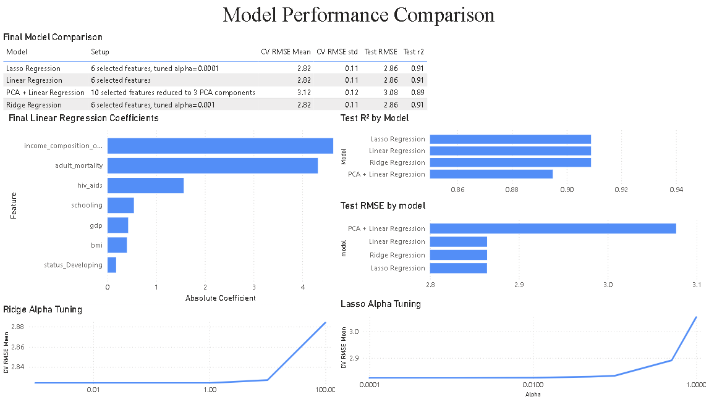
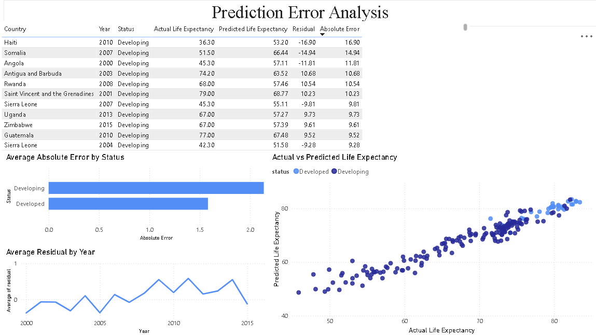
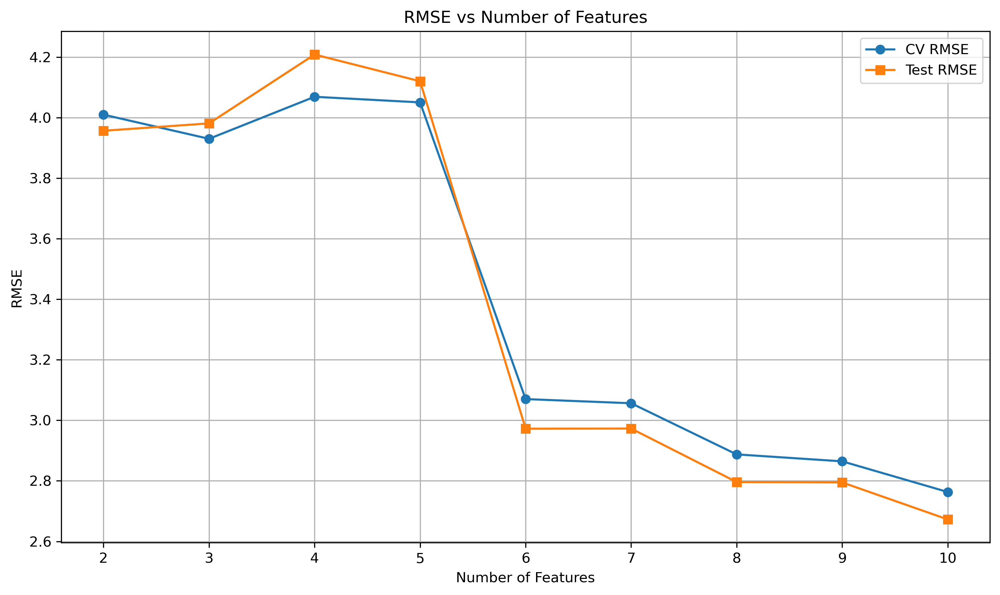
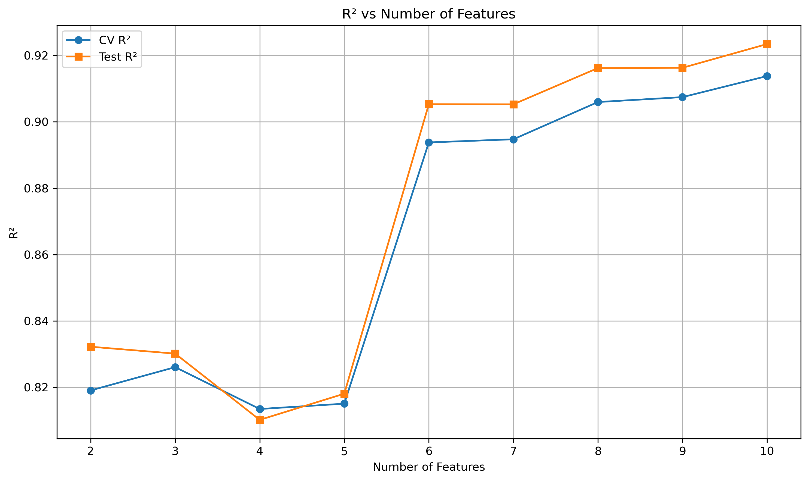
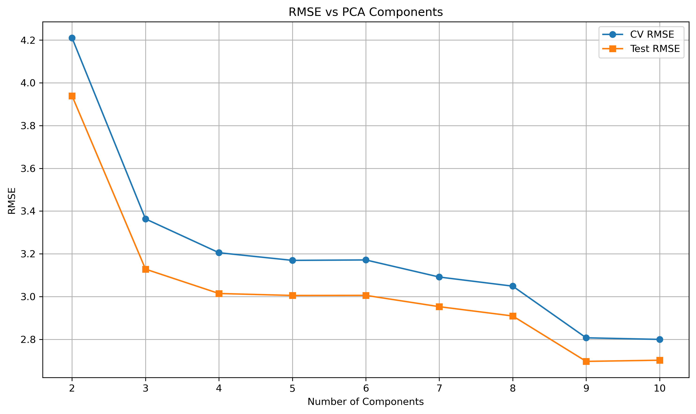
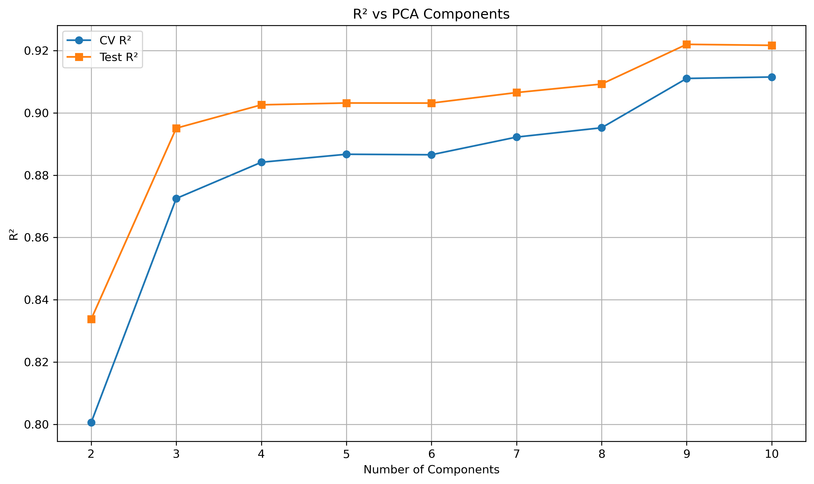

# Life Expectancy Prediction Pipeline Using SQL, Machine Learning, Power BI, FastAPI, Docker, and AWS EC2

## Project Overview

This project predicts national life expectancy using socioeconomic, mortality, health, vaccination, and development-related variables.

The original version of this project compared selected-feature Linear Regression against PCA-based regression. Version 2 expanded the project into a reproducible end-to-end data science pipeline using SQL, DuckDB, modular Python scripts, regularized regression models, model evaluation outputs, and a Power BI dashboard.

Version 3A extends the project further into an engineering-focused machine learning deployment project. The final selected Linear Regression model is persisted as a reusable model artifact, served through a FastAPI REST API, tested with unit tests, containerized with Docker, and deployed on AWS EC2.

The goal is not only to compare model performance, but also to demonstrate a complete workflow from raw data to processed outputs, model evaluation, dashboard-ready files, API serving, containerization, and cloud deployment.

---

## Project Evolution

### Version 1: Academic Modeling Project

The original version focused on:

- Exploratory data analysis
- Linear Regression
- PCA Regression
- Cross-validation
- Feature-count and PCA-component sweeps
- Academic report and notebook deliverables

### Version 2: Reproducible Analytics Pipeline

Version 2 upgraded the project into a more structured analytics and modeling pipeline:

- SQL data preparation with DuckDB
- SQL cleaning and modeling views
- Modular Python preprocessing and modeling scripts
- Linear Regression, Ridge Regression, Lasso Regression, and PCA Regression
- Cross-validation and regularization tuning
- Prediction and residual analysis
- Processed CSV outputs for documentation and dashboarding
- Power BI dashboard outputs
- Cleaned repository structure

### Version 3A: ML Engineering and Deployment

Version 3A turns the validated model workflow into a lightweight deployable ML service:

- Config-driven project settings
- Model persistence with `joblib`
- Saved model metadata
- FastAPI prediction service
- JSON request/response validation
- Logging
- Unit tests with `pytest`
- Docker containerization
- AWS EC2 deployment

---

## Business and Analytics Problem

Life expectancy is influenced by many overlapping factors, including mortality, healthcare access, disease prevalence, education, economic development, and country development status.

This project uses historical country-year data to estimate life expectancy from selected predictors. The goal is not to claim causal relationships, but to build a predictive and interpretable model that can support analytics, dashboarding, and deployment workflows.

The final deployed model accepts a small set of interpretable inputs and returns a predicted life expectancy value through a REST API.

---

## Dataset

The dataset contains 2,928 country-year observations and 22 variables.

The target variable is:

```text
life_expectancy
```

Predictors include variables related to:

- Adult mortality
- Infant and under-five deaths
- Alcohol consumption
- Healthcare expenditure
- Vaccination rates
- BMI and thinness indicators
- HIV/AIDS
- GDP and population
- Schooling
- Income composition of resources
- Country development status

The dataset covers observations from 2000 to 2015 across 183 countries.

---

## Architecture

```text
Raw CSV data
    ?
DuckDB database
    ?
SQL cleaning and modeling views
    ?
Python preprocessing and modeling pipeline
    ?
Processed CSV outputs
    ?
Power BI dashboard
    ?
Persisted model artifact
    ?
FastAPI prediction service
    ?
Docker container
    ?
AWS EC2 deployment
```

---

## Project Workflow

The full Version 2 data/model pipeline can be run from the terminal with:

```bash
python run_pipeline.py
```

This command:

1. Builds the DuckDB database from the raw CSV.
2. Creates clean SQL views and modeling views.
3. Exports dashboard-ready summary tables.
4. Tunes Ridge and Lasso regularization parameters.
5. Evaluates final regression models.
6. Exports model comparison results.
7. Exports prediction and residual outputs for dashboarding.

The Version 3A deployment layer then persists the final selected model with:

```bash
python -m src.train_model
```

This saves:

```text
models/life_expectancy_model.joblib
models/model_metadata.json
```

The persisted model is then served through FastAPI.

---

## Modeling Approach

This project compares four regression approaches:

| Model | Description |
|---|---|
| Linear Regression | Selected-feature regression model optimized for interpretability |
| Ridge Regression | Linear model with L2 regularization |
| Lasso Regression | Linear model with L1 regularization and potential feature shrinkage |
| PCA + Linear Regression | Dimensionality-reduced regression using principal components |

The selected-feature models use six main raw predictors:

- `adult_mortality`
- `income_composition_of_resources`
- `schooling`
- `bmi`
- `gdp`
- `hiv_aids`

The preprocessing pipeline also creates the encoded development-status feature:

```text
status_Developing
```

The PCA model uses a larger selected predictor set reduced to three principal components.

---

## Preprocessing Pipeline

The preprocessing workflow includes:

- Cleaning column names
- Removing high-cardinality country labels from the modeling feature matrix
- Dummy encoding country development status
- Replacing selected zero values with missing values
- Applying log transformations to skewed predictors
- KNN imputation for missing numerical predictors
- Standard scaling
- Optional PCA transformation

All train/test preprocessing is fit on training data only to avoid data leakage.

The deployed FastAPI model preserves the same Version 2 preprocessing behavior instead of using a separate simplified serving pipeline. This keeps the API model aligned with the validated analytics pipeline.

---

## Model Evaluation

Models are evaluated using:

- Root Mean Squared Error, RMSE
- R-squared, R²
- Repeated K-fold cross-validation
- Holdout test-set performance
- Train/test comparison
- Residual and absolute error analysis

Ridge and Lasso alpha values are tuned using cross-validation on the training set only.

---

## Results

The final model comparison showed that Linear Regression, Ridge Regression, and Lasso Regression performed almost identically. PCA + Linear Regression produced slightly weaker test performance, but remained competitive and provided a lower-dimensional representation.

| Model | Setup | Test RMSE | Test R² | Main Interpretation |
|---|---|---:|---:|---|
| Linear Regression | 6 selected features | ~2.86 | ~0.91 | Best simple and interpretable model |
| Ridge Regression | 6 selected features, tuned alpha | ~2.86 | ~0.91 | Similar to Linear Regression; regularization added little improvement |
| Lasso Regression | 6 selected features, tuned alpha | ~2.86 | ~0.91 | Similar performance with L1 regularization |
| PCA + Linear Regression | 10 features reduced to 3 components | ~3.08 | ~0.89 | Lower-dimensional but slightly less accurate |

The deployed Version 3A Linear Regression artifact achieved approximately:

| Metric | Value |
|---|---:|
| Test RMSE | 2.8642 |
| Test R² | 0.9069 |

Overall, the selected-feature Linear Regression model is the preferred deployed model because it is accurate, simple, interpretable, and easy to serve through an API.

---

## FastAPI Prediction Service

Version 3A includes a FastAPI application with three main endpoints:

```text
GET /
GET /health
POST /predict
```

### Example Prediction Request

```json
{
  "adult_mortality": 150,
  "income_composition_of_resources": 0.75,
  "schooling": 13.2,
  "bmi": 25.1,
  "gdp": 5000,
  "hiv_aids": 0.2,
  "status": "Developing"
}
```

### Example Prediction Response

```json
{
  "predicted_life_expectancy": 72.9,
  "model_name": "Linear Regression",
  "model_version": "v3",
  "model_type": "LinearRegression"
}
```

The API accepts the user-friendly `status` field and internally converts it into the encoded feature expected by the trained model.

---

## Running the Project Locally

Clone the repository and install the required packages:

```bash
pip install -r requirements.txt
```

Run the full data/model pipeline:

```bash
python run_pipeline.py
```

Train and persist the deployed model artifact:

```bash
python -m src.train_model
```

Run the FastAPI app locally:

```bash
uvicorn app.main:app --reload
```

Open the local API docs:

```text
http://127.0.0.1:8000/docs
```

To view the notebook walkthrough:

```bash
jupyter notebook life_expectancy_analysis.ipynb
```

To view the Power BI dashboard, open:

```text
powerbi/life_expectancy_dashboard.pbix
```

in Power BI Desktop.

---

## Running Tests

The project includes unit tests for:

- Config loading
- Model artifact loading
- Prediction logic
- FastAPI endpoints

Run:

```bash
pytest
```

Expected result:

```text
8 passed
```

---

## Logging

Version 3A adds project logging through:

```text
src/logger.py
```

Logs are written to:

```text
logs/project.log
```

The log file is ignored by Git, while the folder is preserved with:

```text
logs/.gitkeep
```

Logging currently records model training, model persistence, API startup, health checks, and prediction requests.

---

## Docker Usage

Build the Docker image:

```bash
docker build -t life-expectancy-api .
```

Run the container locally:

```bash
docker run -p 8000:8000 life-expectancy-api
```

Open:

```text
http://127.0.0.1:8000/docs
```

For deployment-style usage with automatic restart:

```bash
docker run -d -p 8000:8000 --restart unless-stopped --name life-expectancy-api-container life-expectancy-api
```

---

## AWS EC2 Deployment

The API was deployed on AWS EC2 using:

```text
EC2 instance: Amazon Linux 2023
Instance type: t3.micro
Container runtime: Docker
Application port: 8000
```

The EC2 security group allowed:

```text
SSH port 22
Custom TCP port 8000
```

Deployment workflow:

```bash
sudo yum update -y
sudo yum install -y git docker
sudo systemctl start docker
sudo systemctl enable docker
sudo usermod -aG docker ec2-user
```

After reconnecting to the EC2 instance:

```bash
git clone -b version-3-api-deployment https://github.com/olveraalec/life-expectancy-regression-pca.git
cd life-expectancy-regression-pca
docker build -t life-expectancy-api .
docker run -d -p 8000:8000 --restart unless-stopped --name life-expectancy-api-container life-expectancy-api
```

Test inside EC2:

```bash
curl http://127.0.0.1:8000/health
```

Example public API docs URL:

```text
http://<ec2-public-dns>:8000/docs
```

Note: the EC2 public DNS can change when the instance is stopped and restarted unless an Elastic IP is attached.

---

## Power BI Dashboard

A Power BI dashboard was created using the processed CSV outputs generated by the pipeline.

### Dataset Overview

This page summarizes the dataset size, country coverage, year range, average life expectancy trends, missingness, and development-status differences.



### Model Performance

This page compares final model performance, Ridge and Lasso tuning behavior, and Linear Regression coefficient magnitudes.



### Prediction Error Analysis

This page explores model prediction errors using actual vs. predicted life expectancy, average absolute error by status, average residuals over time, and the largest prediction errors.



---

## Original Model Visuals

The original notebook version included feature-count and PCA-component sweeps.

### Linear Regression Feature Sweep





### PCA Component Sweep





---

## Key Findings

Linear Regression, Ridge Regression, and Lasso Regression performed nearly identically, suggesting that the selected predictors already capture most of the useful linear signal in the dataset.

Ridge Regression selected a very small optimal alpha value, meaning the regularized model behaved very similarly to standard Linear Regression. Lasso Regression also performed similarly, indicating that stronger coefficient shrinkage was not necessary for this selected feature set.

PCA + Linear Regression had slightly weaker test performance, but it provided a compact lower-dimensional alternative. This supports the original project insight that many predictors contain overlapping information related to health, mortality, education, and economic development.

Prediction error analysis showed that the final model generally tracks actual life expectancy well, though larger errors occur for some country-year observations. These larger errors may reflect historical, political, healthcare, economic, or data-quality conditions not fully captured by the selected predictors.

The results should be interpreted as predictive associations rather than causal effects because the dataset is observational.

---

## Repository Structure

```text
life-expectancy-regression-pca/
¦
+-- app/
¦   +-- __init__.py
¦   +-- main.py
¦   +-- model_loader.py
¦   +-- predict.py
¦   +-- schemas.py
¦
+-- config/
¦   +-- config.yaml
¦
+-- data/
¦   +-- raw/
¦   ¦   +-- life_expectancy.csv
¦   +-- database/
¦   ¦   +-- life_expectancy.duckdb
¦   +-- processed/
¦       +-- overview_summary.csv
¦       +-- status_summary.csv
¦       +-- year_summary.csv
¦       +-- country_summary.csv
¦       +-- missingness_summary.csv
¦       +-- modeling_life_expectancy.csv
¦       +-- ridge_alpha_tuning.csv
¦       +-- lasso_alpha_tuning.csv
¦       +-- model_comparison.csv
¦       +-- predictions.csv
¦       +-- linear_regression_coefficients.csv
¦
+-- experiments/
¦   +-- .gitkeep
¦
+-- figures/
¦   +-- powerbi_dataset_overview.png
¦   +-- powerbi_model_performance.png
¦   +-- powerbi_prediction_error_analysis.png
¦   +-- rmse_vs_features.png
¦   +-- r2_vs_features.png
¦   +-- rmse_vs_pca.png
¦   +-- r2_vs_pca.png
¦
+-- logs/
¦   +-- .gitkeep
¦
+-- models/
¦   +-- life_expectancy_model.joblib
¦   +-- model_metadata.json
¦
+-- powerbi/
¦   +-- life_expectancy_dashboard.pbix
¦
+-- report/
¦   +-- original_academic_report.pdf
¦
+-- sql/
¦   +-- 01_create_raw_table.sql
¦   +-- 02_create_clean_view.sql
¦   +-- 03_data_quality_checks.sql
¦   +-- 04_create_modeling_view.sql
¦   +-- 05_dashboard_exports.sql
¦
+-- src/
¦   +-- __init__.py
¦   +-- build_database.py
¦   +-- config.py
¦   +-- evaluation.py
¦   +-- export_dashboard_data.py
¦   +-- export_model_outputs.py
¦   +-- logger.py
¦   +-- modeling.py
¦   +-- preprocessing.py
¦   +-- train_model.py
¦
+-- tests/
¦   +-- conftest.py
¦   +-- test_api.py
¦   +-- test_config.py
¦   +-- test_model_loader.py
¦   +-- test_predict.py
¦
+-- .dockerignore
+-- .gitignore
+-- Dockerfile
+-- README.md
+-- requirements.txt
+-- run_pipeline.py
+-- life_expectancy_analysis.ipynb
```

---

## Technologies Used

### Data and Modeling

- Python
- Pandas
- NumPy
- scikit-learn
- DuckDB
- SQL
- Jupyter Notebook

### Visualization and Analytics

- Matplotlib
- Seaborn
- Power BI

### Engineering and Deployment

- FastAPI
- Pydantic
- Uvicorn
- Joblib
- PyYAML
- Pytest
- Docker
- AWS EC2
- Git/GitHub

---

## Original Academic Report

The `report/` folder contains the original academic report from the first version of this project. The current repository extends that work into a reproducible SQL + Python pipeline with modular code, regularized regression models, prediction exports, Power BI dashboard outputs, and a deployable FastAPI service.

---

## Future Improvements

This project is intentionally designed as an engineering-focused data science project, not only a modeling experiment. Future extensions will focus on making the workflow more production-like, reproducible, and deployable.

Potential next improvements include:

- Adding simple experiment tracking for training runs
- Adding model version promotion logic
- Using MLflow or a similar tool to track model parameters, metrics, artifacts, and comparison results
- Testing tree-based models such as Random Forest or Gradient Boosting
- Adding nonlinear or interaction feature engineering
- Comparing candidate models against the deployed Linear Regression baseline
- Updating the API to load different model versions from config
- Adding CI checks for tests
- Adding a formal deployment guide
- Attaching an Elastic IP for a stable AWS endpoint
- Deploying with HTTPS through a reverse proxy or managed service
- Adding lightweight monitoring for prediction requests
- Expanding the Power BI dashboard with interactive filters, additional residual diagnostics, and model comparison drilldowns
- Automating dashboard data refresh from generated pipeline outputs

The next modeling phase will happen after the deployment foundation is stable, so model improvements can be tested and promoted in a more realistic engineering workflow.
